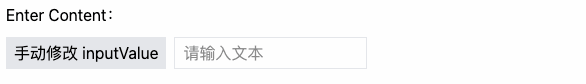

# 概述

Vue 采用了一种基于 HTML 的模板语法，使开发者能够以声明式的方式将组件实例的数据绑定到 DOM 上。Vue 的模板语法是合法的 HTML，可以被所有符合规范的浏览器和 HTML 解析器解析。

在底层实现中，Vue 会将模板编译为高度优化的 JavaScript 代码。结合其强大的响应式系统，Vue 能够在应用状态发生变化时，智能地推导出需要重新渲染的组件，并执行最少的 DOM 操作，从而提升性能。

## \<template /> 标签

`<template />` 是一个字符串模板，用于定义组件的标记。它会 **替换** 挂载元素的 `innerHTML`，挂载元素原有的内容将被忽略，除非模板中包含通过插槽分发的内容。

> **提示**:
>
> 1. `template` 标签的内容不会直接渲染到 DOM 上。
> 2. 在 Vue 3.x 之前，`template` 只允许有一个根元素。
> 3. 在 Vue 3.x 之后，`template` 支持多个根元素，提供了更大的灵活性。

# 插值

数据绑定最常见的形式就是使用 Mustache（双大括号）语法的文本插值：

```vue
<span>Message: {{ msg }}</span>
```

双大括号标签会被替换为相应组件实例中 `msg` 属性的值。同时每次 `msg` 属性更改时它也会同步更新。

接下来我们看一组示例：

```vue
<script setup lang="ts">
const msg = 'Hello, vue3.x!';
const rawHtml = '<div>📮: lihy_online@163.com</div>'
const className = "wrap";
const id = 'box';
const objectOfAttrs = {
  id: 'container',
  class: 'wrapper',
  style: 'background-color:green'
}
const number = 0;
const ok = true;
const message = "ABCDE";

const getLocaleString = () => new Date().toLocaleString();
</script>

<template>
  <!-- 文本插值 -->
  <div>{{ msg }}</div>
  <!-- v-text：指令 -->
  <div v-text="msg" />
  <!-- v-html：指令（可以识别HTML标签） -->
  <div v-html="rawHtml"></div>
  <!-- v-bind：属性绑定 -->
  <div v-bind:class="className"></div>
  <!-- v-bind：简写 -->
  <div :class="className">绑定 class</div>
  <!-- v-bind：同名简写 -->
  <div :id="id">绑定 id</div>
  <div :id>绑定 id</div>
  <!-- 动态绑定多个值 -->
  <div v-bind="objectOfAttrs"></div>
  <!-- 表达式 -->
  <div>{{ number + 1 }}</div>
  <div>{{ ok ? 'YES' : 'NO' }}</div>
  <div>{{ message.split('').reverse().join('') }}</div>
  <!-- 调用函数 -->
  <div>{{ getLocaleString() }}</div>
</template>

<style scoped></style>
```

> 提示：如果你希望绑定响应式数据，则需要使用 `ref` 或 `reactive` 包裹。

# 指令 Directives

指令是带有 `v-` 前缀的特殊属性，Vue 提供了许多[内置指令](https://cn.vuejs.org/api/built-in-directives.html)，供我们使用，下图展示了完整的指令语法：


解读：

1. Name：指令名称，是带有 `v-` 前缀的特殊属性。
2. Argument：指令参数，在指令名称后以冒号（`:`）指明，支持动态参数设置。
3. Modifiers：修饰符，是以点（`.`）开头的特殊后缀，表明指令需要以一些特殊的方式被绑定。
4. Value：指令值

示例：

```html
<div v-bind:class="className"></div>
<input v-model.number="num" type="text">
<button v-on:click="login" type="button">登录</button>
```

上述示例中：

1. 指令：`v-bind`（动态绑定属性） / `v-model`（数据双向绑定） / `v-on`（绑定事件）

2. 参数：`:class`（表示绑定 `class` 属性） / `:click`（表示绑定 `click` 事件）

3. 修饰符：`.number`（表示将输入框的值转换成 `number` 类型）

# 用户输入

在 `input` 输入框中我们可以使用 `v-model` 指令来实现双向数据绑定：

```vue
<script setup lang="ts">
import { ref } from "vue";
// state
const inputValue = ref("");
// events
const onButtonTap = () => {
  inputValue.value = "Hello,Vue.js!";
};
</script>

<template>
  <div style="margin: 10px 0">Enter Content：{{ inputValue }}</div>
  <!-- 通过 v-model 指令实现双向绑定 -->
  <!-- 1）更新inputValue 的值刷新视图 -->
  <!-- 2）在输入框输入内容，更新 inputValue -->
  <div class="flex space-x-2">
    <div class="bg-gray-200 px-2 leading-8 cursor-pointer" @click="onButtonTap">手动修改 inputValue</div>
    <input class="h-8 border border-gray-200 px-2" type="text" v-model="inputValue" placeholder="请输入文本" />
  </div>
</template>
```

示例如下：



# 绑定事件

`v-on` 指令可以绑定事件监听器：

```vue
<script setup lang="ts">
const onButtonTap = () => {
  console.log('The button tag is clicked!');
};
</script>

<template>
  <button type="button" @click="onButtonTap">Tap Me.</button>
</template>
```

> 提示：事件处理的更多知识点请查看 《事件处理器章节》

# 缩写

Vue 为两个最为常用的指令提供了特别的缩写：

## v-bind

`v-bind` 指令允许使用 `:` 替代，后面跟具体绑定的属性名，如下所示：

```html
<!-- 完整语法 -->
<a v-bind:href="url"></a>
<!-- 缩写 -->
<a :href="url"></a>
```

## v-on 

`v-on` 指令允许使用 `@` 替代，后面跟具体的事件名，如下所示：

```html
<!-- 完整语法 -->
<a v-on:click="doSomething"></a>
<!-- 缩写 -->
<a @click="doSomething"></a>
```

# 拓展

## 模板编译原理

- 第一步：将 模板字符串 转换成 element ASTs（解析器）
- 第二步：对 AST 进行静态节点标记，主要用来做虚拟DOM的渲染优化（优化器）
- 第三步：使用 element ASTs 生成 render 函数代码字符串（代码生成器）

## 模板解析

> 思路

1. 在构造函数中接收并保存配置对象 `{el, data}`

2. 调用 `Compile` 编译函数，将 `el` 和 `vm` 传入

3. 在 `Compile` 中保存 `vm`，并根据 `el` 获取对应的 `dom`，将这个 `dom` 元素的所有子节点移动到 `fragment` 中

4. 遍历 `fragment` 中的所有子节点，使用 `compileElement()` 编译此节点

5. 如果子节点是文本节点且匹配到 `{{}}` 格式的文本，则将 `{{}}` 替换成对应的值，如果该节点存在子节点，则递归调用 `compileElement()` 编译此节点

6. 最后将将编译好的 `fragment` 插入到 `el` 对应的 `dom` 中

> 源码

```javascript
// -- ./libs/index.js
class Compile {
  constructor(el, vm) {
    this.$vm = vm;
    this.$el = document.querySelector(el);
    if (this.$el) {
      // -- 将$el所有子节点移动到fragment中
      this.$fragment = this.nodeToFragment(this.$el);
      // -- 编译 fragment
      this.compileElement(this.$fragment);
      // -- 将编译好的fragment插入到el中
      this.$el.appendChild(this.$fragment);
    }
  }
  nodeToFragment(el) {
    // 1. 创建 fragment 对象
    var fragment = document.createDocumentFragment();
    var child;
    // 2. 将原生节点移动到fragment中
    while ((child = el.firstChild)) {
      fragment.appendChild(child);
    }
    // 3. 返回 fragment
    return fragment;
  }
  compileElement(el) {
    var _this = this;
    var childNodes = el.childNodes;
    Array.prototype.slice.call(childNodes).forEach((node) => {
      // 创建匹配{{}}格式的正则
      // 禁止贪婪{{xxx}}--{{bbb}} → xxx 和 bbb（会匹配到2个）
      // 如果不禁止贪婪 就会变成{{xxx}}--{{bbb}} → xxx}}--{{bbb
      var reg = /\{\{(.*?)\}\}/;
      // 使用循环将此节点的所有{{xxx}}依次替换成vm.$data对应的值
      while (node.nodeType === 3 && reg.test(node.textContent)) {
        // 获取{{}}中变量在vm.$data中对应的值
        var val = _this.getData(
          _this.$vm,
          reg.exec(node.textContent)[1].trim()
        );
        // 获取原始的值
        var oldVal = node.textContent;
        // 用vm.$data中对应的值将{{xxx}}替换掉
        node.textContent = oldVal.replace(reg, val);
      }
      // 如果该节点存在 且 有子节点 则调用递归 编译此节点
      if (node.childNodes && node.childNodes.length) {
        _this.compileElement(node);
      }
    });
  }
  // -- 获取变量在vm.data中对应的值
  getData(vm, exp) {
    var val = vm.$data;
    exp.split('.').forEach((k) => {
      val = val[k];
    });
    return val;
  }
}

class Vue {
  constructor(options) {
    // --  初始值
    this.$options = options || {};
    this.$data = options.data;
    // -- 调用编译函数
    new Compile(options.el, this);
  }
}
```

```html
<!-- 模板文件 -->
<div id="app">
  <p>Name: {{name}}</p>
  <p>Age: {{age}}</p>
  <p>Email: {{email}}</p>
  <p>Address: {{ address }}</p>
</div>
```

```javascript
new Vue({
  el: '#app',
  data: {
    name: 'Li-HONGYAO',
    age: 28,
    email: 'lihy_online@163.com',
  },
});
```

渲染结果：

```html
<div id="app">
  <p>Name: Li-HONGYAO</p>
  <p>Age: 28</p>
  <p>Email: lihy_online@163.com</p>
  <p>Address: undefined</p>
</div>
```

