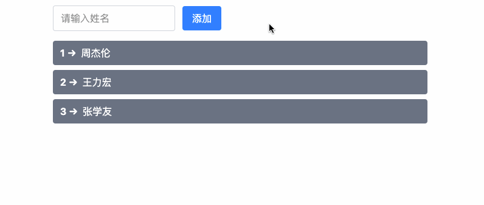

@See https://cn.vuejs.org/guide/essentials/list.html

# 列表渲染

在 Vue 3 中，v-for 指令用于基于数组或对象渲染列表。它允许你根据数组中的每个元素生成一系列 DOM 元素。v-for 指令的基本语法如下：

```vue
<li v-for="(item, index) in items" :key="index">{{ item }}</li>
```

**语法解释：**

- `items`：要迭代的源数据数组。
- `item`：表示当前迭代项的别名，也就是数组中的每个元素。
- `index`：表示当前元素在数组中的索引（位置）。
- `:key="index"`：每个被迭代的元素都应该有一个唯一的 key，这是为了提高渲染性能。Vue 使用 key 来跟踪每个元素并进行高效的更新

# 迭代示例

```vue
<script setup lang="ts">
import { reactive } from 'vue';
const heros = reactive([
  { name: '张良' },
  { name: '露娜' },
  { name: '妲己' },
  { name: '甄姬' },
  { name: '虞姬' },
]);

const user = reactive({
  name: 'Li-HONGYAO',
  job: '前端工程师',
});
</script>

<template>
  <!-- 遍历数字 -->
  <ul><li v-for="(item, index) in 5" :key="index">index：{{ index }} -- item：{{ item }}</li></ul>
  <!-- 遍历数组 -->
  <ul><li v-for="(item, index) in heros" :key="index">{{ item.name }}</li></ul>
  <!-- 遍历对象 -->
  <ul><li v-for="(value, key, index) in user" :key="index">{{key}}：{{value}}({{index}})</li></ul>
</template>
```

# `v-for` 作用于 template

与模板上的 `v-if` 类似，你也可以在 `<template>` 标签上使用 `v-for` 来渲染一个包含多个元素的块。例如：

```vue
<ul>
  <template v-for="item in items">
    <li>{{ item.msg }}</li>
    <li class="divider" role="presentation"></li>
  </template>
</ul>
```

# `v-for` vs. `v-if`

> ⚠️ **注意**：同时使用 `v-if` 和 `v-for` 是**不推荐的**，因为这样二者的优先级不明显。

当它们同时存在于一个节点上时，`v-if` 比 `v-for` 的优先级更高。这意味着 `v-if` 的条件将无法访问到 `v-for` 作用域内定义的变量别名：

```vue
<!-- 这会抛出一个错误，因为属性 todo 此时没有在该实例上定义 -->
<li v-for="todo in todos" v-if="!todo.isComplete">
  {{ todo.name }}
</li>
```

在外先包装一层 `<template>` 再在其上使用 `v-for` 可以解决这个问题 (这也更加明显易读)：

```vue
<template v-for="todo in todos">
  <li v-if="!todo.isComplete">
    {{ todo.name }}
  </li>
</template>
```

# 通过 key 管理状态

在 Vue 3 中，v-for 默认使用**就地更新**策略来渲染列表。当数据项的顺序改变时，Vue **不会**重新排列 DOM 元素，而是**直接修改**每个元素的内容，保持它们在原始索引位置。这种方式通常可以提高性能，但在某些情况下可能会导致意外行为。

> 📖 **为什么 key 重要？**

如果列表中的每个元素**依赖子组件状态或临时 DOM 状态**（例如：表单输入值、焦点、动画），默认的就地更新模式可能会导致错误。例如：

```vue
<input v-for="item in items" :value="item.text">
```

如果 items 发生重新排序，Vue 只是就地更新元素的值，而不会移动它们的 DOM 位置，这可能导致用户输入的内容错乱。

> 📖 **解决方案：使用 key**

为 Vue 提供 key，让它跟踪每个元素的唯一标识，这样 Vue 就能正确地复用、更新和重新排序元素，而不会影响状态：

```vue
<div v-for="item in items" :key="item.id">
  <input v-model="item.text">
</div>
```

> 📖 **key 的作用**

在 Vue 的虚拟 DOM 机制中，key 主要用于高效对比新旧节点。当数据变化时：

1. **无 key**：Vue 尽可能尝试就地修改、复用相同类型的元素，而不会主动移动它们的位置。
2. **有 key**：Vue 会基于 key 重新排列元素，并**销毁**已经不存在的 key 对应的元素。

因此，正确使用 key 可以避免因就地更新导致的 UI 问题。

# 数组变化侦测

## 变更方法

Vue 能够侦听响应式数组的变更方法，并在它们被调用时触发相关的更新。这些变更方法包括：

- `push()`
- `pop()`
- `shift()`
- `unshift()`
- `splice()`
- `sort()`
- `reverse()`

我们来看一组示例：

```vue
<script setup lang="ts">
import { ref } from 'vue';

const inputValue = ref('');
const names = ref(['周杰伦', '王力宏', '张学友']);

const onPushItem = () => {
  const name = inputValue.value.trim();
  if (!name || names.value.includes(name)) return;
  names.value.push(name);
  inputValue.value = ''; // 清空输入框
};
</script>

<template>
  <!-- 表单 -->
  <form class="mb-4 flex items-center space-x-3">
    <input
      v-model="inputValue"
      placeholder="请输入姓名"
      class="px-3 py-2 border border-gray-300 rounded focus:outline-none focus:ring-2 focus:ring-blue-400"
    />
    <button 
      type="button"
      @click="onPushItem"
      class="px-4 py-2 bg-blue-500 text-white rounded hover:bg-blue-600 transition"
    >
      添加
    </button>
  </form>

  <!-- 列表 -->
  <div class="space-y-2">
    <div 
      v-for="(item, index) in names" 
      :key="item"
      class="flex items-center px-3 py-2 bg-gray-500 text-white rounded"
    >
      <span class="mr-2 font-bold">{{ index + 1 }} →</span>
      <span>{{ item }}</span>
    </div>
  </div>
</template>
```

演示效果：



通过示例效果可以看到，变异方法 `push` 修改了原始数组，触发视图更新。上面的示例只演示了 `push` 方法，其他变异方法下来之后大家可以自行尝试。

## 替换一个数组

变更方法会直接修改原数组，而不可变方法（如 `filter()`、`concat()`、`slice()`）则返回新数组，因此需要手动替换 ref 的值。例如：

```js
// items 是一个数组的 ref
items.value = items.value.filter((item) => item.message.match(/Foo/));
```

Vue 采用优化策略，尽可能复用 DOM 元素，因此即使替换为一个部分重叠的新数组，依然能保持高效渲染。

# 展示过滤或排序后的结果

如果需要显示经过**过滤或排序**的数组而不修改原始数据，可以使用**计算属性**返回新数组。例如：

```js
const numbers = ref([1, 2, 3, 4, 5]);

const evenNumbers = computed(() => numbers.value.filter(n => n % 2 === 0));
```

```vue
<li v-for="n in evenNumbers" :key="n">{{ n }}</li>
```

当计算属性不可行时（如**多层 v-for 嵌套**），可以使用方法：

```js
const sets = ref([
  [1, 2, 3, 4, 5],
  [6, 7, 8, 9, 10]
]);

const even = (numbers) => numbers.filter(n => n % 2 === 0);
```

```vue
<ul v-for="(numbers, index) in sets" :key="index">
  <li v-for="n in even(numbers)" :key="n">{{ n }}</li>
</ul>
```

> ⚠️ **注意**：在计算属性中使用 `reverse()` 和 `sort()` 时，应**先复制数组**，避免修改原数据：

```js
// ❌ 直接修改原数组（错误）
return numbers.reverse();

// ✅ 复制后再排序（正确）
return [...numbers].reverse();
```

# 示例：使用 ref 获取列表元素的 DOM 引用

本示例展示了如何使用 Vue 3 的 ref 来收集 v-for 生成的列表项 (\<li>) 的 DOM 引用，并在 onMounted 钩子中访问它们。这样可以在组件挂载后操作这些元素，例如添加样式或绑定事件。

```vue
<script setup lang="ts">
import { ref, onMounted } from 'vue';

const refs = ref<(HTMLLIElement | null)[]>([]);

const heros = ref([
  { name: '张良' },
  { name: '露娜' },
  { name: '妲己' },
  { name: '甄姬' },
  { name: '虞姬' },
]);

onMounted(() => {
  console.log(refs.value);
});
</script>

<template>
  <ul>
    <li v-for="(item, index) in heros" :key="index" ref="refs">
      {{ item.name }}
    </li>
  </ul>
</template>
```